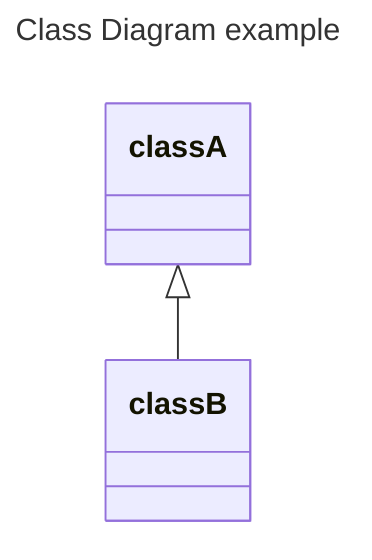

# UML

## 1. UML이란?

Unified Modeling Language의 약자  
소프트웨어 개발에서 시스템을 시각적으로 모델링하고 문서화 하기 위해 사용되는 표준화된 언어  


## 2. UML 다이어그램

UML을 시각적으로 표현하는 그래픽 언어  
사실상 프로그램 구성이나 진행을 그림으로 표현한 것이라고 보면 된다.  


## 3. UML 다이어그램의 종류

#### 1) 자주 사용되는 UML 다이어그램
- 클래스 다이어그램 (Class Diagram)  
- 시퀀스 다이어그램 (Sequence Diagram)  
- 유스케이스 다이어그램 (Use Case Diagram)  
- 상태 다이어그램 (Statechart Diagram)  
- 활동 다이어그램 (Activity Diagram)

#### 2) 그 외 다이어그램
- 오브젝트 다이어그램 (Object Diagram)  
- 패키지 다이어그램 (Package Diagram)  
- 컴포넌트 다이어그램 (Component Diagram)  
- 복합 구조 다이어그램 (Composite Structure Diagram)  
- 배치 다이어그램 (Deployment Diagram)  
- 커뮤니케이션 다이어그램 (Communication Diagram)  
- 타이밍 다이어그램 (Timing Diagram)  
- 상호 작용 개요 다이어그램 (Interaction Overview Diagram)

## 4. UML 다이어그램 그리는 툴

정말 많은 툴이 있는데 유/무료에 따라 성능도 많이 다르고 사용법도 조금씩 다른듯하다.  
개발자들이 많이 사용하는 툴은 마크다운 형식으로 작성하면 UML 다이어그램으로 변경해주는 mermaid인듯 하다.  
Github에서 오픈소스로 많은 사람들이 참여해서 개발하는 툴이다.  
클래스 다이어그램, 시퀀스 다이어그램 등 뿐만 아니라 ERD도 그릴 수 있다고 한다.  

튜토리얼)  
[https://mermaid.js.org/intro/](https://mermaid.js.org/intro/)

다이어그램 그리는 곳)  
[http://mermaid.live/](http://mermaid.live/)

옵시디언에서도 자체제공해서 소스코드 작성하듯이 mermaid로 감싸고 시작하면 UML 다이어그램으로 출력해준다.  
````

````