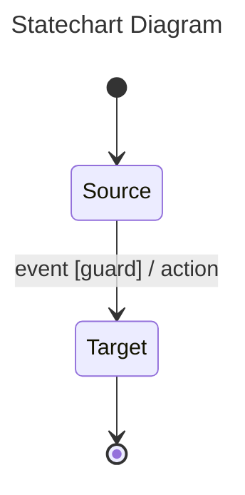
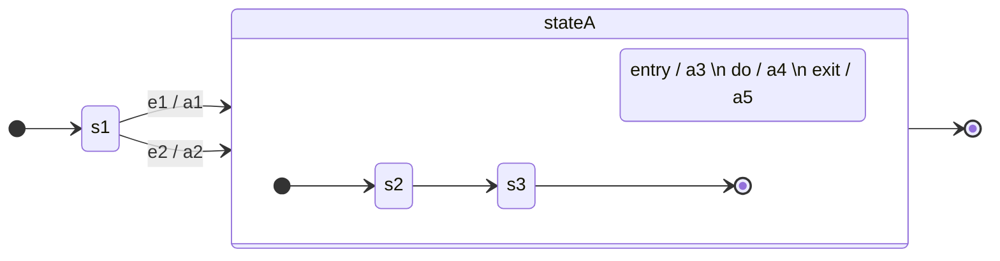
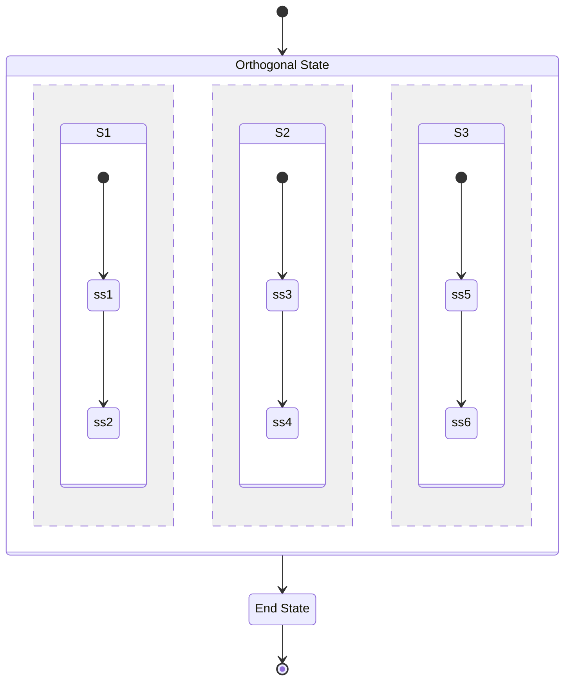
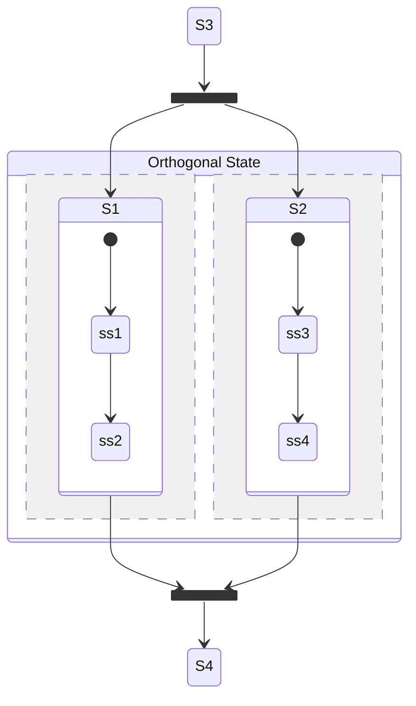
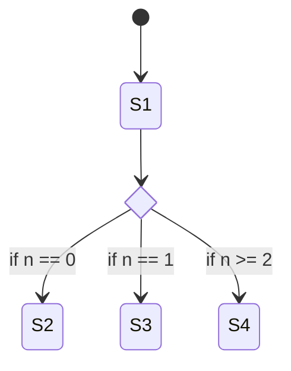
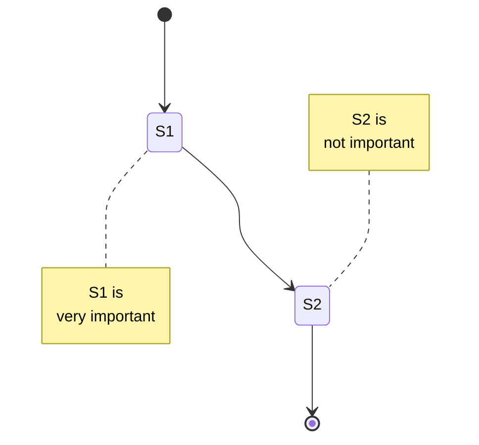

# 상태 다이어그램(Statechart Diagram)

## 1. 상태 다이어그램이란?

객체나 구성요소의 **상태에 대해 다루며**, 조건/기능에 따른 상태 변화에 대해 표현하는 다이어그램  
동적인 측면을 시각화할때 사용하며 시스템이 주고받는 이벤트를 순서대로 표현할 수 있다.  

활동 다이어그램(Activity Diagram)과 굉장히 유사하기 때문에 잘 구분해야 한다.  
상태 다이어그램은 말 그대로 상태가 어떻게 변하는지 보는데 집중한다.  
활동 다이어그램은 어떤 활동들을 순서로 진행하는지 보는데 집중한다.  


## 2. 구성 요소

- 시작점
- 마침점
- 상태
- 전이(Transition)

#### 1) 시작점
그래프를 시작하는 지점을 나타내는 요소  
아래처럼 꽉 차있는 원으로 그리며 테두리는 검은색이어도 상관없음  


#### 2) 마침점
그래프를 끝내는 지점을 나타내는 요소  
조금 비어있는 원으로 그리며 테두리는 검은색이어도 상관없음  


#### 3) 상태
상태를 나타내는 요소  
모서리를 직각이 아닌 둥근 형태의 사각형으로 그림  
예를들어 "문 열림", "문 닫힘"같은 상태가 들어감  
주의할점은 상태가 들어가야하는것이므로 "문 열기", "문 닫기"같은 행동이 들어가선 안됨  

상태는 그냥 상태만 작성할 수도 있지만 entry, do, exit의 동작이 포함될 수도 있음  
- entry :  해당 state에 들어올 경우 하는 행동  
- do :  해당 state를 유지하고 있을 때 하는 행동  
- exit :  해당 state에서 벗어날 때 하는 행동


위의 상태의 경우 해당 상태로 입장시 a3행동을 하며, 해당 상태를 유지한 동안은 a4행동을, 나갈땐 a5행동을 한 후 나간다라는 의미가 됨  


보통 do가 끝나면 특별한 트리거가드가 없는 한 다음상태로 전이하게 됨  

#### 4) 전이
상태의 변화를 표현할때 사용  
한방향을 가리키는 화살표로 사용하며, 하나의 화살표에 양쪽으로 가리킬 수 없음  
상태를 오가는 경우라면 화살표를 2개 사용해서 가리키게 작성해야 함  

전이는 집단의 규칙에따라 다양한 방법으로 작성될 수 있는데  
`<<행동>>` 형태로 행동만 표시하기도 하고, `행동[조건]` 의 형태로 표시하기도 하고,  
`트리거[가드] / 액티비티` 의 형태로 표시하기도 함, 가드조건에 맞으면 트리거가 발동되어 액티비티를 한다하는 의미  


첫번째 화살표는 그냥 문열기 동작을 하면 상태가 바뀐다는 뜻이 되고  
두번째 화살표의 경우 조건이 맞다면 문열기 행동을 하고, 문열기를 하고나면 상태가 바뀐다는 뜻이며  
세번째 화살표의 경우 x <= 2 조건(가드)이 맞으면 event(트리거)가 발생해서 x = x * 2 행동(액티비티)을 하고나서 상태가 바뀐다는 뜻이 된다.  


## 3. 사용 예시

#### 예시 1)

위의 상태 다이어그램은 프로그램 시작시 Source 상태에 놓인다는 뜻이며  
guard라는 조건이 맞으면 이벤트가 발생해서 action을 수행한 후 Target상태가 된다는 뜻이다.  
그 후 Target 상태에서 나가게 되면 프로그램이 종료된다.  

#### 예시2)

위의 상태 다이어그램은 프로그램 시작시 s1상태에 놓인다는 뜻이며  
e1이벤트가 발생한다면 a1행동을 한 후 stateA로 진입하고  
혹은 e2 이벤트가 발생한다면 a2행동을 한 후 stateA로 진입하게 된다.  
  
stateA에 진입하면 entry행동으로 a3를 수행한 후 s2상태에 놓인다.  
그 후 `s2 -> s3`상태를 거치며 do인 a4행동을 하며, 나갈땐 exit인 a5행동을 한 후 stateA에서 벗어나며, stateA에서 벗어나면 프로그램이 종료된다.  

#### 예시3)

위의 상태 다이어그램은 프로그램 시작시 S1상태로 들어가며 entry에 의해 x = 1로 설정된다.  
그 후 x <= 2 조건에 맞으므로 이벤트가 발생해서 exit행동인 x++을 해서 x = 2가 된 후 S1상태에서 벗어나며  
이벤트 행동인 x = x * 2에 의해 x = 4가 된 후 S2에 진입한다.  
S2에 진입할때 entry에 의해 x += 5하게되고 x=9상태가 된다.    


## 4. 복합적인 상태 다이어그램

#### 1) OR State
내부 상태들 중 **하나의 상태만** 실행된다.  

위의 상태 다이어그램의 경우 시작시 A상태로 들어간다. 그리고 e1이 발생하면 A exit으로 a1을 수행 후 액티비티로 a2가 실행된다.  
이제 B상태가 되었고 B entry인 a4가 실행되고 B1.1상태가 된다. 또 B1.1상태의 entry인 a6가 실행된다.  

반면 처음에 A상태에서 e1이 아닌 e2가 실행되었다면 a1 -> a3 수행 후 entry인 a4를 실행 후 B1.2 상태로 진입한다.  
그럼 B1.2의 entry인 a9가 실행된다.  

#### 2) AND State
내부 상태들을 점선으로 된 사각형 안에 그리며, 내부 상태들이 **동시에** 실행된다.  

위의 상태 다이어그램의 경우 상태에 진입시 S1, S2, S3 상태를 모두 동시에 가지며 동시에 실행한다.  

#### 3) Fork와 Join
S1과 S2를 동시에 실행시키기 위해 Fork를 사용해서 한 점에서 모여서 동시에 진행하게 만들 수 있다.  
또한 S1과 S2가 둘 다 끝나면 넘어가도록 기다리게 하기 위해 Join을 사용할 수 있다.  


#### 4) Choice
조건문에 따라 분기시킬 수 있다.  


## 5. mermaid로 그리기

#### 1) 시작점과 마침점
`[*]`  로 표기한다.  

#### 2) 전이
`-->` 로 표기한다.  
`:` 를 사용해서 텍스트를 추가할 수 있다.  
````

````


방향을 세로가 아닌 가로로 표기하고 싶다면 direction LR 키워드를 추가한다.  
```
---
title: Statechart Diagram
---
  stateDiagram
    direction LR  
    [*] --> Source
    Source --> Target : event [guard] / action
    Target --> [*]
```


#### 3) 상태
`state 스테이트 이름 {}` 형태로 작성한다.  
state의 이름엔 기본적으로 띄어쓰기가 들어갈 수 없다. 다만 alias로 쓰면 띄어쓰기도 사용 가능하다.  
state의 이름에 띄어쓰기를 작성하거나, 별명을 만들고 싶다면 아래처럼 사용한다.
```
state "표기이름" as 별명
// 또는
state : 표기이름
```

entry, do, exit을 표기하는 메모를 따로 지원하지는 않아서 state안에 표기하는 식으로 표현한다.  
alias로 entry, do, exit 내용을 표기하게 만든다.  
````

````


#### 4) 복합적인 상태 다이어그램
동시에 진행된다는 것은 `--` 를 이용해 표시한다.  
````

````


#### 5) Fork와 Join

둘 다 `<<fork>>` 명령어로 사용한다.  
````

````


#### 6) Choice
````

````


#### 7) 주석과 Note
주석은 `%%` 로 사용하면 된다.  
Note는 `note [right / left] of state ~ end note` 를 사용한다.  
````

````


※ 참고 문헌  
[https://ko-de-dev-green.tistory.com/96](https://ko-de-dev-green.tistory.com/96)
[https://bloodstrawberry.tistory.com/1410](https://bloodstrawberry.tistory.com/1410)
[https://bloodstrawberry.tistory.com/1411](https://bloodstrawberry.tistory.com/1411)
[https://www.youtube.com/watch?v=1Vinu58-RgY](https://www.youtube.com/watch?v=1Vinu58-RgY)