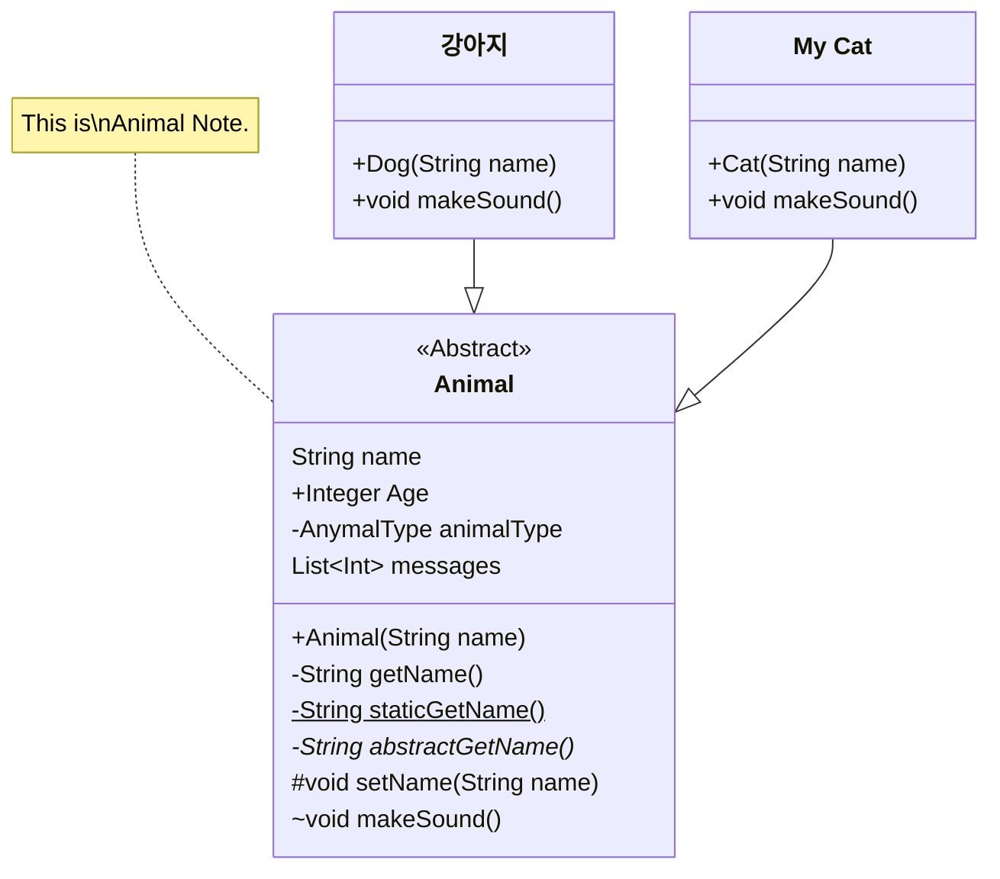

```mermaid
  classDiagram 
    %% Animal Class    
    class Animal { 
      String name
      +Integer Age
      -AnymalType animalType
      List~Int~ messages
      +Animal(String name) 
      -String getName() 
      -String staticGetName() $
      -String abstractGetName() *       
      #void setName(String name)
      ~void makeSound()
    }

    class Dog {
      +Dog(String name)
      +void makeSound()
    }
    class `My Cat` {
      +Cat(String name)
      +void makeSound()
    }
     
    %% 추상화 클래스 표시
    <<Abstract>> Animal

    %% Dog 클래스를 강아지로 라벨링
    class Dog["강아지"]    

    %% Aniaml 클래스에 메모 추가
    note for Animal "This is\nAnimal Note."

    %% 상속 관계 표시
    Dog --|> Animal
    `My Cat` --|> Animal
```
